## 🚀 What I'm working on

- 🔍 **RAG & Vector Search** — building retrieval-augmented generation pipelines and exploring embedding/vector store strategies
- 🤖 **AI Agent Systems** — designing agentic workflows on top of LLMs (tool use, orchestration, MCP servers)
- 📚 **Scholar projects** — coursework at CyTECH spanning simulation and distributed data engineering
- 📡 Currently building **[NoviT](https://github.com/rmouahid/NoviT)**, an MCP server giving Claude real-time tech news from 25+ sources

## 🛠️ Tech Stack

**AI/ML & Data:** `LangChain` `Vector Databases` `MCP` `PySpark` `GraphFrames` `RAG`

## 📌 Featured Projects

<table width="100%">
  <tr>
    <td width="50%" valign="top">
      <h3>🗞️ <a href="https://github.com/rmouahid/NoviT">NoviT</a></h3>
      
MCP server providing Claude with real-time tech news from 25+ sources (AI, security, engineering, regulation) with profile-based filtering.

      
    </td>
    <td width="50%" valign="top">
      <h3>📄 <a href="https://github.com/rmouahid/doc-centralizer">doc-centralizer</a></h3>
      
Self-hosted RAG documentation assistant — local LLM (Phi-3 via llama.cpp), sentence-transformers embeddings, FAISS retrieval, multi-format ingestion, packaged with Docker and CI/CD.

      
    </td>
  </tr>
</table>

## 📊 GitHub Stats

<i>📫 Reach out — always happy to talk AI, data engineering, or opportunities abroad.</i>

